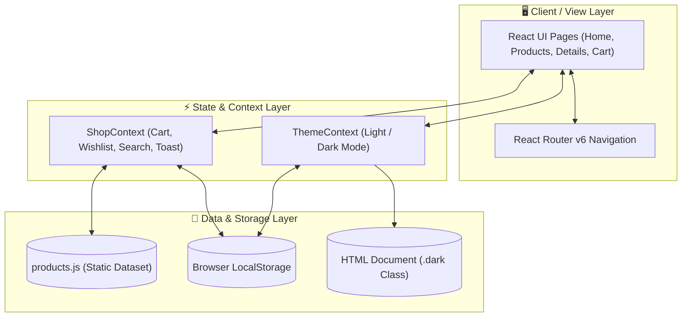

# ⚡ NEXORA — Premium Modern E-Commerce Platform

> A high-performance, minimalist, and accessible frontend e-commerce experience inspired by modern luxury platforms.


---

## 📐 System Design & Architecture

### 1. High-Level System Architecture



#### Visual Data Flow Schema

```
[ User Interaction ] 
        │
        ▼
[ View Layer (Pages / Components) ]
        │
        ├──► [ React Router v6 ] ──► (URL Routing & Navigation)
        │
        ├──► [ Theme Context ]  ──► (DOM Root .dark Class & LocalStorage)
        │
        └──► [ Shop Context ]   ──► [ Products Dataset ]
                   │
                   ├──► Cart State       ──► [ LocalStorage ]
                   ├──► Wishlist State   ──► [ LocalStorage ]
                   ├──► Active Filters   ──► (Live Product Grid)
                   └──► Notification Toast
```

---

### 2. Component Hierarchy & Module Breakdown

```
App Component (Root Provider)
 ├── ThemeProvider (Dark / Light Theme Persistence)
 └── ShopProvider (Cart, Wishlist, Search, Toast Notification State)
      └── Router (React Router v6)
           ├── ScrollToTop (Route Scroll Position Reset)
           ├── Navbar (Sticky Navigation, Logo, Search, Badges, Dark Toggle, Mobile Drawer)
           ├── Toast (Floating Feedback Banner)
           ├── Viewport Router Outlet
           │    ├── Home Page (Hero, Categories, Featured, DealBanner, Benefits, Newsletter)
           │    ├── Products Catalog Page (Search, FilterSidebar Drawer, Sort, ProductGrid)
           │    ├── Product Details Page (Gallery, Specs, Options Selector, Add/Buy Now, Related)
           │    └── Cart Page (CartItems, Shipping Tracker, Promo Engine, Checkout Modal)
           └── Footer (Multi-column Links, Copyright, Security Badges)
```

---

### 3. State Management Design Pattern

NEXORA utilizes a decoupled, Context-driven state architecture (`ShopContext` and `ThemeContext`) with custom custom hooks (`useShop`, `useTheme`):

* **Cart State Structure**:
  ```ts
  cart: Array<{
    product: Product;
    quantity: number;
    selectedSize: string | null;
  }>
  ```
* **Wishlist State Structure**: `wishlist: Array<string>` (Set of Product IDs)
* **Theme State Persistence**: Automatically checks system preferences (`prefers-color-scheme`) and persists user choices in `localStorage`. Synchronizes directly with Tailwind's `.dark` DOM root selector.
* **Reactive Toast Queue**: Dispatches non-blocking user feedback banners when cart or wishlist actions occur.

---

## ✨ Core Features

* 🌓 **Dynamic Dark Mode**: Fully supported dark/light theme switching with zero layout shift.
* 🔍 **Real-time Live Search & Multi-filter**: Filter products seamlessly by category, price slider ($50 - $1000), minimum star rating, and stock availability.
* 🛍️ **Interactive Cart & Wishlist**: Real-time badge counts, item quantity adjustment, wishlist transfer, free shipping progress tracker ($100 goal), and promo discount simulator (`NEXORA10`).
* 🏷️ **Special Deal Flash Banner**: Ticking countdown clock timer for flash drops.
* 📱 **100% Mobile Responsive**: Customized hamburger drawers, collapsible filter sidebars, and fluid layout scaling.

---

## 📁 Directory Structure

```
nexora/
├── index.html                  # HTML entry point with Google Fonts
├── package.json                # Dependencies and scripts
├── vite.config.js              # Vite configuration
├── tailwind.config.js          # Tailwind styling tokens & dark mode strategy
├── postcss.config.js           # PostCSS configuration
└── src/
    ├── index.css               # Global styles and custom utilities
    ├── main.jsx                # DOM Mount point
    ├── App.jsx                 # Main layout & router definition
    ├── data/
    │   └── products.js         # 16 products & 6 category metadata
    ├── context/
    │   ├── ThemeContext.jsx    # Dark mode context & persistence
    │   └── ShopContext.jsx     # Global shop state context
    ├── hooks/
    │   └── useShop.js          # Custom hook for shop state
    ├── components/
    │   ├── Navbar.jsx          # Header navigation bar
    │   ├── Hero.jsx            # Hero section showcase
    │   ├── CategoryCard.jsx    # Category card component
    │   ├── ProductCard.jsx     # Reusable product card
    │   ├── ProductGrid.jsx     # Grid wrapper & empty state handler
    │   ├── SearchBar.jsx       # Controlled live search input
    │   ├── FilterSidebar.jsx   # Filter panel & mobile drawer
    │   ├── RatingStars.jsx     # Star rating renderer
    │   ├── DealBanner.jsx      # Countdown flash deal banner
    │   ├── FeatureCard.jsx     # Benefit feature cards
    │   ├── CartItem.jsx        # Cart item row component
    │   ├── Footer.jsx          # Multi-column footer
    │   ├── Toast.jsx           # Floating notification toast
    │   └── ScrollToTop.jsx     # Viewport scroll position reset
    └── pages/
        ├── Home.jsx            # Home page view
        ├── Products.jsx        # Products catalog page view
        ├── ProductDetails.jsx  # Single product details view
        └── Cart.jsx            # Shopping cart page view
```

---

## 🚀 Getting Started

### Prerequisites
Make sure you have Node.js (v18+) and npm installed on your system.

### Setup Instructions

1. **Clone the repository**:
   ```bash
   git clone https://github.com/kartikshete/nexora-ecommerce.git
   cd nexora-ecommerce
   ```

2. **Install dependencies**:
   ```bash
   npm install
   ```

3. **Start the development server**:
   ```bash
   npm run dev
   ```
   Open your browser and navigate to `http://localhost:5173`.

4. **Build for production**:
   ```bash
   npm run build
   ```

---

## 🔮 Future Development Roadmap

- [ ] **Phase 2**: User Authentication (JWT / Firebase / Supabase)
- [ ] **Phase 3**: Node.js / Express Backend & Database (PostgreSQL / MongoDB)
- [ ] **Phase 4**: Stripe / PayPal Payment Gateway Integration
- [ ] **Phase 5**: Seller & Admin Management Dashboard
- [ ] **Phase 6**: AI Product Recommendations Engine

---

## 📄 License

This project is licensed under the MIT License — see the [LICENSE](LICENSE) file for details.
